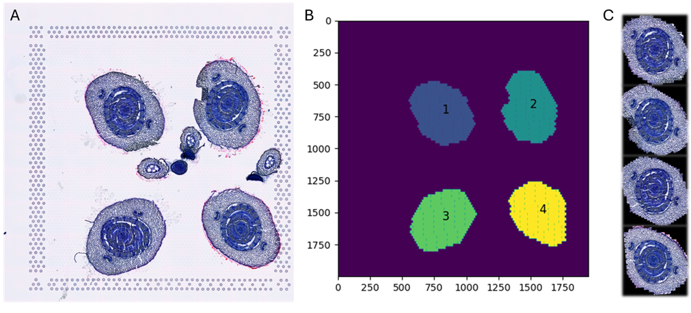
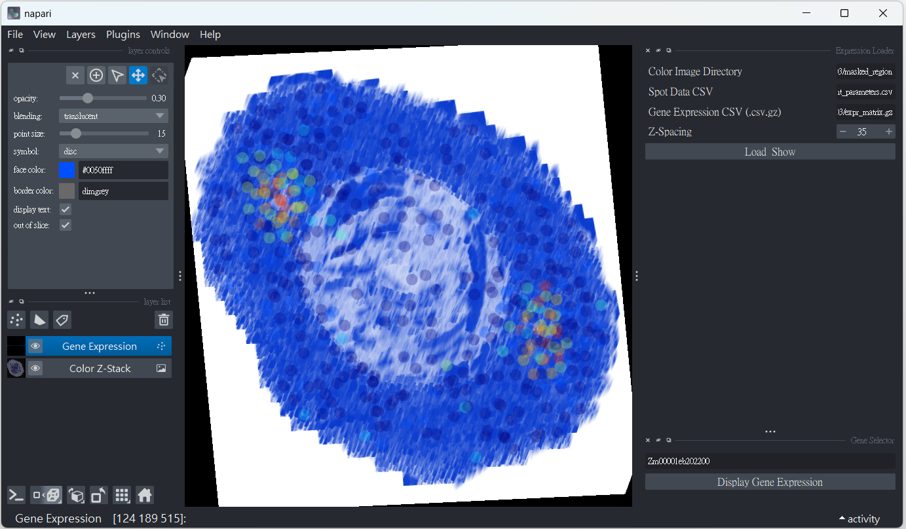

# Napari-3D Gene Expression Explorer
**Interactive 3D visualization of histology stacks with overlaid gene expression spots—simple to run, easy to reproduce.**

---

## ✨ What this plugin does

We ship a minimal, easy-to-run Napari project (plugin + example dataset) so readers can reproduce and interactively explore reconstructed 3D volumes:
  (a) Load pre-aligned histological cross-sections from 2D PNG slices.
  (b) Stack & reconstruct the slices into a 3D volume.
  (c) Map gene expression values onto spot/region coordinates.
  (d) Save/restore Napari layers for flexible visualization and follow-up analysis.

[](https://opensource.org/licenses/MIT)

Under the hood, the script:
 - auto-discovers images named like region_<id>.png and stacks them by ascending <id>
 - expects a spots CSV with columns: region_id, spot_id, pixel_x, pixel_y
 - expects a compressed expression matrix *.csv.gz with genes as rows and spot IDs as columns (to match spot_id)
 - lets you type a gene symbol and instantly overlay its expression as colored points in 3D

## 📁 Repository layout
```arduino
.
├─ code/
│  └─ napari_gene_expression_plugin.py
├─ data/
│  ├─ VR03/        # used in README
│  └─ DQ02/
└─ images/
   ├─ procedure.png             # workflow: align → stack → map expression
   └─ visualization.png         # colored gene expression overlaid in 3D
```

More processed datasets for Napari interactive viewer were deposited in the Zenodo (https://zenodo.org/records/16933147)

## ⚙️ Installation (direct run)
We provide a direct command-line approach (no packaging needed).
1. Create an environment (recommended)
```bash
# conda (recommended)
conda create -n napari-3d python=3.10 -y
conda activate napari-3d
```
2. Install Python dependencies
```bash
pip install napari[all] magicgui qtpy numpy pandas scikit-image matplotlib
```
3. Run the viewer
```bash
python code/napari_gene_expression_plugin.py
```

## 🚀 Quick Start (with the included example)

1. Images: put aligned PNG slices in a folder, named region_<integer>.png
  - e.g., region_1.png, region_2.png, … (these define z-order)
  - - Sample folder: data/VR03/masked_region/
2. Spots: CSV with columns:
  - region_id (matches <integer> in the PNG name), spot_id, pixel_x, pixel_y
  - Example file: alignment_parameters.csv located in data/VR03/
3. Expression: *.csv.gz where rows = genes, columns = spot IDs (matching spot_id above).
  - In Napari:
    - Click “Load & Show”, select:
    - Color Image Directory → the folder of region_*.png
    - Spot Data CSV → your spots file
    - Gene Expression CSV (.csv.gz) → compressed expression matrix
    - Z-Spacing → set voxel depth scaling (e.g., 35)
    - Type a Gene Name and click “Display Gene Expression” → A Gene Expression points layer is added/updated and colored by expression (JEt colormap).
    - The stacked images appear as a 3D volume; rotate, zoom, and slice as needed.
    - Example file: expr_matrix.csv.gz in data/VR03/

## 🖼️ Examples
Workflow Overview: Pre-Aligned Histological Cross-Sections from 2D Images

(A) Initial histological 2D image.
(B) Detection and extraction of four relevant cross-sections, labeled 1 through 4.
(C) Alignment of the extracted sections with corresponding tissue types, guided by color-coded references. The four sections are arranged vertically from top to bottom.

3D Visualization With Gene Overlay

Interactive 3D visualization of spatial gene expression in embryonic leaves using Napari. (A) Four aligned embryonic leaf images are stacked and rendered in blue within a 3D interface. Spatial expression of the gene Zm00001eb202200 is visualized using a color map, where blue indicates lower expression and red indicates higher expression. Regions with read counts greater than zero are highlighted. (B) The 3D visualization is rotated to display multiple viewing angles, facilitating spatial interpretation of gene expression across leaf structures.

## Viewer behavior & controls
 - 3D by default: viewer.dims.ndisplay = 3
 - Image layer: added as Color Z-Stack, adjustable opacity and blending
 - Points layer (Gene Expression):
    - Size: 15 (tweakable in Napari)
    - Opacity: ~0.2 (adjust to taste)
    - Color: continuous colormap (based on expression intensity)
    - Out-of-slice display: enabled (so you can see all points in 3D)
 - Z-spacing: applied via scale=(z_spacing, 1, 1) so distances look proportional along z.

## 🧪 Reproducibility notes
 - Use the included data/VR03 to replicate the screenshots above.
 - Ensure image filenames and region_id are consistent (e.g., region_5.png ↔ region_id = 5).
 - Spot IDs must match columns in the expression matrix. Any mismatch will simply skip those points.

## 🤝 Contributing
Issues and pull requests are welcome! Please:
  - Keep PRs focused and documented
  - Include a minimal dataset or steps to reproduce
  - Add inline comments for non-obvious logic

## 📚 Cite this project
If you use this plugin in a paper or talk, please cite:

`Serial Spatial Transcriptomes Reveal Regulatory Transitions in Maize Leaf Development
Chi-Chih Wu, Ludvig Larsson, Chun-Ping Yu, Kun-Ting Hsieh, Yi-Hua Chen, Kai-Hsuan Ding, Ho-Chun Yang, Joakim Lundeberg, Chin-Min Kimmy Ho, Shu-Hsing Wu, Mei-Yeh Jade Lu, Wen-Hsiung Li.`

## 📄 License
This project is licensed under the MIT License - see the [LICENSE](LICENSE) file for details.

## 🙏 Acknowledgments
  - Built with Napari, magicgui, scikit-image, matplotlib, NumPy, Pandas, and Qt.
  - Thanks to the community for inspiring reproducible, interactive imaging workflows.
