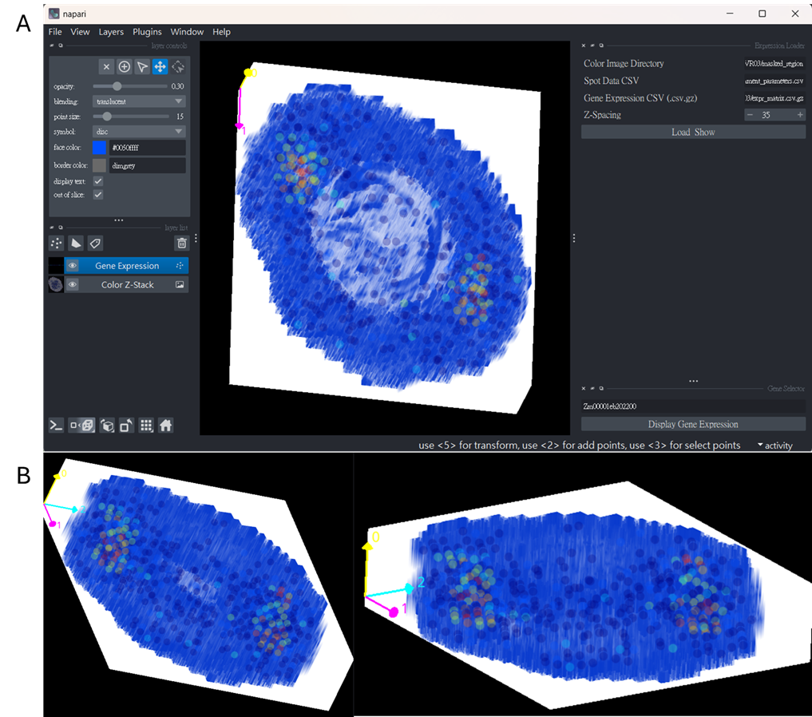

# Napari-3D Gene Expression Explorer
**Interactive 3D visualization of histology stacks with overlaid gene expression spots—simple to run, easy to reproduce.**

---

## ✨ What this plugin does

We ship a minimal, easy-to-run Napari project (plugin + example dataset) so readers can reproduce and interactively explore reconstructed 3D volumes:
  (a) Load pre-aligned histological cross-sections from 2D PNG slices.
  (b) Stack & reconstruct the slices into a 3D volume.
  (c) Map gene expression values onto spot/region coordinates.
  (d) Save/restore Napari layers for flexible visualization and follow-up analysis.

Under the hood, the script:
 - auto-discovers images named like region_<id>.png and stacks them by ascending <id>
 - expects a spots CSV with columns: region_id, spot_id, pixel_x, pixel_y
 - expects a compressed expression matrix *.csv.gz with genes as rows and spot IDs as columns (to match spot_id)
 - lets you type a gene symbol and instantly overlay its expression as colored points in 3D

## 📁 Repository layout
```arduino
.
├─ code/
│  └─ napari_gene_expression_plugin.py
├─ data/
│  ├─ example_dataset_1/        # used in README
│  └─ example_dataset_2/
└─ images/
   ├─ procedure.png             # workflow: align → stack → map expression
   └─ visualization.png         # colored gene expression overlaid in 3D
```

## ⚙️ Installation (direct run)
We provide a direct command-line approach (no packaging needed).
1. Create an environment (recommended)
```bash
# conda (recommended)
conda create -n napari-3d python=3.10 -y
conda activate napari-3d
```
2. Install Python dependencies
```bash
pip install napari[all] magicgui qtpy numpy pandas scikit-image matplotlib
```
3. Run the viewer
```bash
python code/napari_gene_expression_plugin_v1.py
```

## 🚀 Quick Start (with the included example)

1. Images: put aligned PNG slices in a folder, named region_<integer>.png
  - e.g., region_1.png, region_2.png, … (these define z-order)
2. Spots: CSV with columns:
  - region_id (matches <integer> in the PNG name), spot_id, pixel_x, pixel_y
3. Expression: *.csv.gz where rows = genes, columns = spot IDs (matching spot_id above).
  - In Napari:
    - Click “Load & Show”, select:
    - Color Image Directory → the folder of region_*.png
    - Spot Data CSV → your spots file
    - Gene Expression CSV (.csv.gz) → compressed expression matrix
    - Z-Spacing → set voxel depth scaling (e.g., 35)
    - Type a Gene Name and click “Display Gene Expression” → A Gene Expression points layer is added/updated and colored by expression (JEt colormap).
    - The stacked images appear as a 3D volume; rotate, zoom, and slice as needed.

## 🖼️ Examples
Workflow Overview: Pre-Aligned Histological Cross-Sections from 2D Images

(A) Start with a histological 2D image.
(B) Detect and extract relevant cross-sections within the image.
(C) Align the extracted cross-sections to corresponding tissue types using color-coded references.

3D Visualization With Gene Overlay

Stacking and reconstruction of these aligned sections into 3D volumes

## Viewer behavior & controls
 - 3D by default: viewer.dims.ndisplay = 3
 - Image layer: added as Color Z-Stack, adjustable opacity and blending
 - Points layer (Gene Expression):
    - Size: 15 (tweakable in Napari)
    - Opacity: ~0.2 (adjust to taste)
    - Color: continuous colormap (based on expression intensity)
    - Out-of-slice display: enabled (so you can see all points in 3D)
 - Z-spacing: applied via scale=(z_spacing, 1, 1) so distances look proportional along z.

## 🧪 Reproducibility notes
 - Use the included data/example_dataset_1 to replicate the screenshots above.
 - Ensure image filenames and region_id are consistent (e.g., region_5.png ↔ region_id = 5).
 - Spot IDs must match columns in the expression matrix. Any mismatch will simply skip those points.

## 🤝 Contributing
Issues and pull requests are welcome! Please:
  - Keep PRs focused and documented
  - Include a minimal dataset or steps to reproduce
  - Add inline comments for non-obvious logic

## 📚 Cite this project
If you use this plugin in a paper or talk, please cite:

`Serial Spatial Transcriptomes Reveal Regulatory Transitions in Maize Leaf Development
Chi-Chih Wu, Ludvig Larsson, Chun-Ping Yu, Kun-Ting Hsieh, Yi-Hua Chen, Kai-Hsuan Ding, Ho-Chun Yang, Joakim Lundeberg, Chin-Min Kimmy Ho, Shu-Hsing Wu, Mei-Yeh Jade Lu, Wen-Hsiung Li.`

## 📄 License
MIT (recommended). Add your chosen license text in LICENSE.

## 🙏 Acknowledgments
  - Built with Napari, magicgui, scikit-image, matplotlib, NumPy, Pandas, and Qt.
  - Thanks to the community for inspiring reproducible, interactive imaging workflows.
